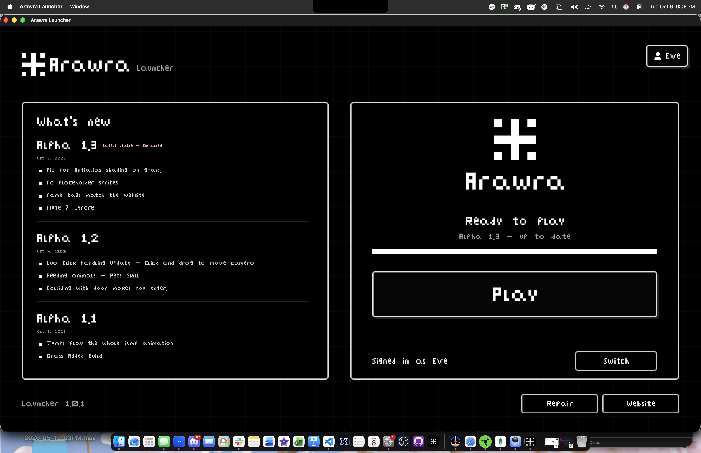
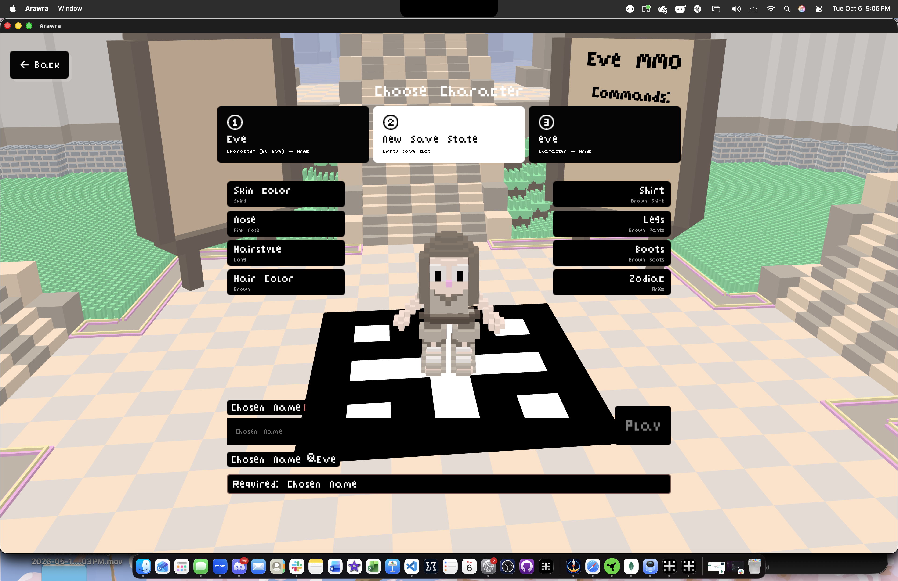
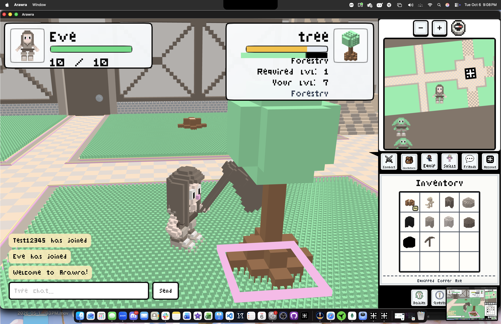

# Arawra

A 3d voxel art animation MMO.

Playable in browser and on a downloadable client. 

It is heavily inspired by WoW, RuneScape and Web apps like FarmVille. 

## Play on Web - Support us on itch.io

|Platform |Links|
|---|---|
|React App |[Arawra.net](https://arawra.net)|
|itch.io|[itch.io/arawra](https://evepanzarino.itch.io/arawra)|

## Download the Launcher

| MacOS | Windows | Linux |
|---|---|---|
[Arawra-Launcher-macOS.zip](https://arawra.net/download/Arawra-macOS.zip)| [Arawra-Launcher-Windows.zip](https://arawra.net/download/Arawra-Windows.zip)| [Arawra-Launcher-Linux.tar.gz](https://arawra.net/download/Arawra-Linux.tar.gz) |

**Features:**
- Character customization
- Leveling Skills
- Friends
- Equipment
- Dailies &amp; Quests
  
Built in React and Lua. 

Future plans to make a React Native version for an Android and IOS app. 

## Arawra Social Accounts

|Social |Links|
|---|---|
|Youtube|[youtube.com/@arawrammo](https://youtube.com/@arawrammo)|
|Bluesky|[bsky.app/profile/arawra.net](https://bsky.app/profile/arawra.net)|
|Facebook|[facebook.com/arawrammo](https://facebook.com/arawrammo)
|Instagram|[instagram.com/arawrammo](https://instagram.com/arawrammo)|
|Tiktok|[tiktok.com/arawrammo](https://www.tiktok.com/@arawrammo)|

## Screenshots

